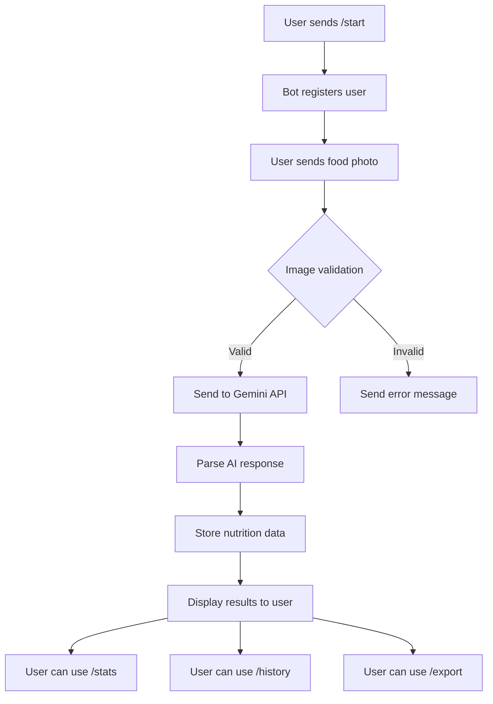

## 1. Product Overview
AI Nutrition Coach Telegram Bot that analyzes food photos using Google Gemini 1.5 Flash API to provide instant nutritional breakdown and running performance optimization tips. Users simply send food photos to receive detailed calorie and macronutrient analysis with personalized sports nutrition guidance.

Target market: Runners, athletes, and fitness enthusiasts seeking convenient nutrition tracking through Telegram messaging platform.

## 2. Core Features

### 2.1 User Roles
| Role | Registration Method | Core Permissions |
|------|---------------------|------------------|
| Telegram User | Automatic via /start command | Send food photos, view nutrition stats, access history |

### 2.2 Feature Module
Our AI Nutrition Coach Telegram Bot consists of the following main features:
1. **Photo Analysis**: Process food images and extract nutritional data
2. **Daily Tracking**: Aggregate and display daily nutrition summaries
3. **User Management**: Handle user registration and preferences
4. **Data Export**: Provide nutrition history in CSV format

### 2.3 Page Details
| Page Name | Module Name | Feature description |
|-----------|-------------|---------------------|
| Bot Commands | /start | Initialize user registration and onboarding flow |
| Bot Commands | /help | Display usage instructions and command list |
| Bot Commands | Photo Handler | Receive and validate food images, process through AI analysis |
| Bot Commands | /stats | Calculate and display daily nutrition totals with macro percentages |
| Bot Commands | /history | Retrieve and display past nutrition entries |
| Bot Commands | /export | Generate and send CSV file with nutrition data |
| Bot Commands | Error Handler | Display user-friendly error messages for all failure scenarios |

## 3. Core Process
**User Flow:**
1. User sends /start command to begin interaction
2. Bot welcomes user and provides usage instructions
3. User sends food photo to bot
4. Bot validates image and sends to Gemini API for analysis
5. AI returns nutritional data (calories, protein, carbs, fats) plus running tip
6. Bot stores data in database and displays results to user
7. User can check daily totals with /stats command
8. User can view history with /history command
9. User can export data with /export command

## 4. User Interface Design

### 4.1 Design Style
- **Primary Color**: Telegram blue (#0088cc) for bot messages
- **Secondary Color**: Green (#28a745) for success indicators
- **Error Color**: Red (#dc3545) for validation failures
- **Font**: Telegram's default system font
- **Layout**: Single-message responses with emoji indicators
- **Emoji Style**: Food emojis (🍎🥗🍗) and fitness emojis (🏃‍♂️💪) for visual appeal

### 4.2 Page Design Overview
| Page Name | Module Name | UI Elements |
|-----------|-------------|-------------|
| /start response | Welcome message | "Welcome to AI Nutrition Coach! 🏃‍♂️ Send me photos of your meals and I'll analyze the nutrition for you. Use /help for commands." |
| Photo analysis result | Nutrition breakdown | "📊 Nutrition Analysis:\n🔥 Calories: 450\n🥩 Protein: 35g\n🍞 Carbs: 28g\n🥑 Fats: 18g\n\n💡 Running Tip: This meal provides excellent protein for muscle recovery!" |
| /stats response | Daily summary | "📈 Today's Totals:\n🔥 Total Calories: 1,850\n🥩 Total Protein: 125g (27%)\n🍞 Total Carbs: 180g (39%)\n🥑 Total Fats: 70g (34%)\n\n████████░░ 85% of daily goal" |
| /help response | Command list | "Available commands:\n📸 Send food photos for analysis\n📊 /stats - View today's totals\n📅 /history - View past entries\n📥 /export - Download CSV data\n❓ /help - Show this message" |

### 4.3 Responsiveness
Telegram Bot interface is inherently mobile-first and responsive across all devices. Messages adapt to screen size and support both touch and keyboard interactions.

### 4.4 3D Scene Guidance
Not applicable - this is a text-based Telegram bot without 3D content.