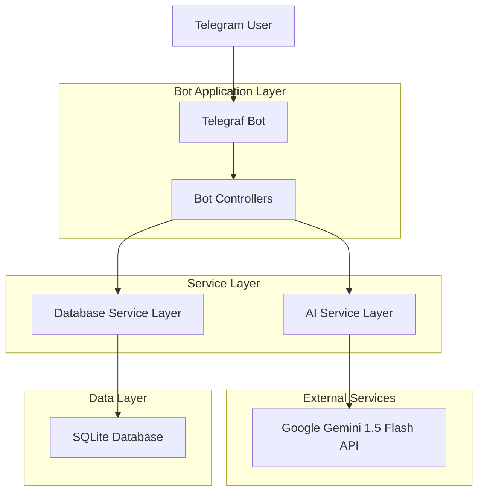
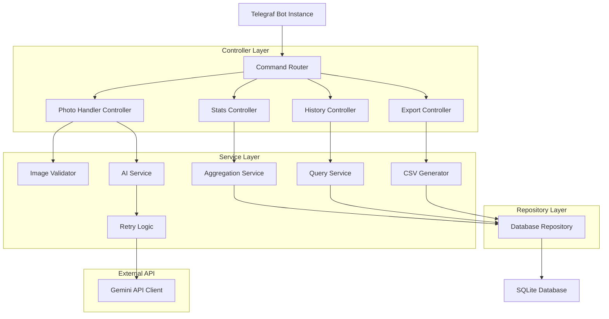
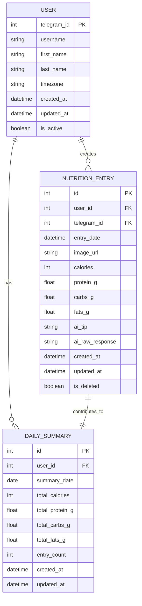

## 1. Architecture design



## 2. Technology Description
- **Backend**: Node.js@18 + TypeScript + Telegraf@4
- **Database**: SQLite3 with better-sqlite3 driver
- **AI Integration**: Google Gemini 1.5 Flash API
- **Initialization Tool**: npm init with TypeScript configuration
- **Testing**: Jest + Supertest for unit and integration tests
- **Logging**: Winston for structured logging
- **Environment**: dotenv for configuration management

## 3. Route definitions

### Telegram Bot Commands
| Command | Purpose |
|---------|---------|
| /start | Initialize user registration and onboarding |
| /help | Display available commands and usage instructions |
| /stats | Show daily nutrition totals and macro breakdown |
| /history | Display past nutrition entries |
| /export | Generate and send CSV export of user data |
| Photo message | Process food image for nutritional analysis |

## 4. API definitions

### 4.1 Core Bot Commands

**Photo Analysis Handler**
```
ON photo_message
```

Request Processing:
- Validate image format (JPEG, PNG)
- Check file size (< 10MB)
- Rate limit check (max 5 photos per hour per user)
- Send to Gemini API for analysis
- Parse response for nutritional data
- Store in database
- Return formatted nutrition breakdown

**Stats Command Handler**
```
ON /stats command
```

Response Format:
```typescript
interface NutritionStats {
  totalCalories: number;
  totalProtein: number;
  totalCarbs: number;
  totalFats: number;
  proteinPercentage: number;
  carbsPercentage: number;
  fatsPercentage: number;
  progressBar: string;
}
```

### 4.2 External API Integration

**Google Gemini 1.5 Flash API**
```
POST https://generativelanguage.googleapis.com/v1beta/models/gemini-1.5-flash:generateContent
```

Request Body:
```typescript
interface GeminiRequest {
  contents: [{
    parts: [{
      text: string;
      inline_data?: {
        mime_type: string;
        data: string;
      };
    }];
  }];
  generationConfig: {
    temperature: number;
    topK: number;
    topP: number;
    maxOutputTokens: number;
  };
}
```

System Prompt:
```
"You are a sports nutritionist. Estimate Calories, Protein (g), Carbs (g), and Fats (g) from this image. Output the numbers clearly, and add a brief tip for optimizing running performance and power-to-weight ratio."
```

## 5. Server architecture diagram



## 6. Data model

### 6.1 Data model definition



### 6.2 Data Definition Language

**Users Table**
```sql
CREATE TABLE users (
    telegram_id INTEGER PRIMARY KEY,
    username TEXT,
    first_name TEXT,
    last_name TEXT,
    timezone TEXT DEFAULT 'UTC',
    created_at DATETIME DEFAULT CURRENT_TIMESTAMP,
    updated_at DATETIME DEFAULT CURRENT_TIMESTAMP,
    is_active BOOLEAN DEFAULT 1
);

CREATE INDEX idx_users_telegram_id ON users(telegram_id);
CREATE INDEX idx_users_username ON users(username);
```

**Nutrition Entries Table**
```sql
CREATE TABLE nutrition_entries (
    id INTEGER PRIMARY KEY AUTOINCREMENT,
    user_id INTEGER NOT NULL,
    telegram_id INTEGER NOT NULL,
    entry_date DATE NOT NULL,
    image_url TEXT,
    calories INTEGER NOT NULL,
    protein_g REAL NOT NULL,
    carbs_g REAL NOT NULL,
    fats_g REAL NOT NULL,
    ai_tip TEXT,
    ai_raw_response TEXT,
    created_at DATETIME DEFAULT CURRENT_TIMESTAMP,
    updated_at DATETIME DEFAULT CURRENT_TIMESTAMP,
    is_deleted BOOLEAN DEFAULT 0,
    FOREIGN KEY (user_id) REFERENCES users(telegram_id)
);

CREATE INDEX idx_nutrition_entries_user_id ON nutrition_entries(user_id);
CREATE INDEX idx_nutrition_entries_entry_date ON nutrition_entries(entry_date);
CREATE INDEX idx_nutrition_entries_telegram_id ON nutrition_entries(telegram_id);
CREATE INDEX idx_nutrition_entries_created_at ON nutrition_entries(created_at);
```

**Daily Summaries Table**
```sql
CREATE TABLE daily_summaries (
    id INTEGER PRIMARY KEY AUTOINCREMENT,
    user_id INTEGER NOT NULL,
    summary_date DATE NOT NULL,
    total_calories INTEGER DEFAULT 0,
    total_protein_g REAL DEFAULT 0,
    total_carbs_g REAL DEFAULT 0,
    total_fats_g REAL DEFAULT 0,
    entry_count INTEGER DEFAULT 0,
    created_at DATETIME DEFAULT CURRENT_TIMESTAMP,
    updated_at DATETIME DEFAULT CURRENT_TIMESTAMP,
    FOREIGN KEY (user_id) REFERENCES users(telegram_id),
    UNIQUE(user_id, summary_date)
);

CREATE INDEX idx_daily_summaries_user_id ON daily_summaries(user_id);
CREATE INDEX idx_daily_summaries_summary_date ON daily_summaries(summary_date);
```

**Database Triggers for Daily Summary Updates**
```sql
CREATE TRIGGER update_daily_summary_after_insert
AFTER INSERT ON nutrition_entries
FOR EACH ROW
WHEN NEW.is_deleted = 0
BEGIN
    INSERT OR REPLACE INTO daily_summaries (
        user_id, summary_date, total_calories, total_protein_g, 
        total_carbs_g, total_fats_g, entry_count
    )
    SELECT 
        user_id,
        entry_date,
        SUM(calories),
        SUM(protein_g),
        SUM(carbs_g),
        SUM(fats_g),
        COUNT(*)
    FROM nutrition_entries
    WHERE user_id = NEW.user_id 
    AND entry_date = NEW.entry_date 
    AND is_deleted = 0
    GROUP BY user_id, entry_date;
END;
```